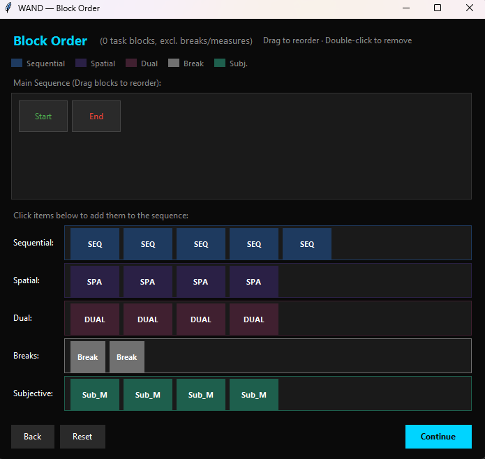

<p align="center">
  
</p>

<h1 align="center">WAND</h1>
<p align="center"><strong>Working-memory Adaptive-fatigue with N-back Difficulty</strong></p>

<p align="center">
  <a href="https://github.com/brodie-neuro/WAND-practice-and-fatigue-induction/actions/workflows/ci.yml">
    
  </a>
  &nbsp;
  
  &nbsp;
  
</p>

---

## 🧠 What is WAND?

WAND is an **open-source cognitive fatigue research suite** built on PsychoPy. It provides:

- **Adaptive N-back tasks** (Spatial, Dual) that calibrate to individual performance
- **Practice Plateau Protocol** to eliminate learning effects and stabilise performance
- **Standardised Sequential N-back** for fatigue induction with comprehensive behavioural metrics
- **Full Signal Detection Theory metrics** (d', criterion, hit rate) in every CSV output

> **No coding required.** WAND includes a professional GUI that lets you configure entire experiments visually.

---

## ✨ For Researchers: GUI-First Design

<table>
<tr>
<td width="50%">

### 🖥️ Visual Experiment Builder
- **Point-and-click configuration**: no coding required; optional JSON for EEG and advanced settings
- **Drag-and-drop block ordering**: design your protocol visually
- **Real-time preview** of experiment structure

</td>
<td width="50%">

### ⚡ Quick Setup
1. Install: `pip install git+https://github.com/brodie-neuro/WAND-practice-and-fatigue-induction.git`
2. Launch: `wand-launcher`
3. Configure your study in the GUI
4. Run experiments immediately

</td>
</tr>
</table>

<p align="center">
  
  <br>
  <em>The Block Builder interface: drag-and-drop experiment design</em>
</p>

---

## 📦 Current Release: v1.1.1

### Highlights
- **pip-installable**: standard Python packaging with entry points
- **GUI Launcher**: multi-page wizard for complete experiment customisation
- **Block Builder**: visual drag-and-drop interface for experiment design
- **EEG Triggers**: fully configurable parallel port codes via `params.json`
- **Full SDT Metrics**: d', criterion (c), hits, false alarms in all output

See [`Changelog.md`](Changelog.md) for the complete history.

---

## Overview

WAND is a set of PsychoPy scripts that calibrate N-back capacity and then induce active cognitive fatigue by sustained loading of non-verbal working memory. The suite provides a standardised protocol you can reuse and configure through external JSON files.

## Task Components

| Script                     | Purpose                                                                                     | Typical Duration |
|---------------------------|---------------------------------------------------------------------------------------------|------------------|
| `WAND_practice_plateau.py`| Calibrates individual N-back capacity through adaptive difficulty until performance stabilises (≤ 7% variability) | 20–60 minutes |
| `WAND_full_induction.py`  | Induces cognitive fatigue with Sequential, Spatial, and Dual N-back tasks                   | 65–70 minutes including breaks |
| `Tests/quicktest_induction.py` | Automated smoke test to verify installation (25s runtime)                          | < 1 minute |


## Design Principles

| Feature                     | Purpose |
|----------------------------|---------|
| Task modalities            | Sequential, Spatial, and Dual N-back tasks tax the same fronto parietal networks in complementary ways |
| Adaptive difficulty        | Automatic level adjustment and linear timing compression maintain appropriate challenge for Spatial and Dual |
| Mini distractors           | Brief 200 ms visual flashes probe inhibitory control and vigilance within blocks |
| Practice plateau           | Requires stability ≤ 7 percent variability over three consecutive blocks to separate fatigue from learning |
| Balanced target ratio      | 50 to 50 target to non-target prevents response bias and supports sensitivity metrics |
| Engagement supports        | Lapse cues and colour coded N levels help maintain attention without confounding the tasks |

## Task Algorithms

### 1. Sequential N-back
- 24 abstract PNG images
- 164 trials per full block
- Baseline timings: 0.80 s presentation, 1.00 s ISI
- Targets at approximately 50 percent of eligible positions, never more than 2 in a row

### 2. Spatial N-back
- 12 position radial grid (clock face)
- Timing compression per normal speed block  
  - Presentation: 1.00 s minus 0.03 s times block number, minimum 0.85 s  
  - ISI: 1.00 s minus 0.05 s times block number, minimum 0.775 s

### 3. Dual N-back
- 3 by 3 grid with image overlay
- Timing compression per normal speed block  
  - Presentation: 1.00 s minus 0.03 s times block number, minimum 0.85 s  
  - ISI: 1.20 s minus 0.05 s times block number, minimum 1.05 s

### Block Duration Notes

> **Important for researchers configuring timing parameters:**
>
> - **Sequential blocks**: Duration = 164 trials × (display + ISI). Adjusting timing parameters **changes total block duration**.
> - **Spatial/Dual blocks**: Duration is **fixed at 270 seconds (4.5 minutes)** regardless of timing settings. Adjusting timing affects trial pacing and number of trials, not total block duration.
> - **Time compression** (SPA/DUAL): Only applied after Block 1. Block 1 always uses standard timing.

## Key Features for Fatigue Induction

| Feature                | Effect |
|-----------------------|--------|
| Adaptive N-back       | Maintains a challenging but manageable load. Thresholds are documented in `README_experiment.md`. |
| Timing compression    | Per block reduction of presentation and ISI forces sustained vigilance |
| Background grid       | 100 px spacing and 20 percent opacity grey texture that must be ignored to increase control demands |
| Mini distractors      | 200 ms white square inserted pseudo randomly, with spacing constraints |

## Subjective Measurements

During the induction phase, participants complete brief self reports roughly every 15 minutes:
- Perceived mental fatigue
- Task effort
- Mind wandering
- Task overwhelm

Responses use 1 to 8 Likert scales and are saved alongside behavioural data in `./data/`.

## Installation

### Prerequisites

**Python 3.10+** is recommended for the smoothest installation experience.

Python 3.8+ is also supported, but you may need to upgrade pip first:

### Quick Verification

To verify your installation without running a full 60-minute experiment, run the quicktest script:

```bash
python Tests/quicktest_induction.py
```

This simulates a rapid 25-second version of the full induction protocol (Sequential, Spatial, Dual) to verify graphics, sound, and logging.

### Option 1: pip install (Recommended)

Install directly from GitHub:

```bash
pip install git+https://github.com/brodie-neuro/WAND-practice-and-fatigue-induction.git
```

This automatically installs all dependencies and creates command-line entry points.

> **Windows Users**: If you encounter compilation errors (e.g., `ffpyplayer` or `cl.exe` failures), install PsychoPy first using binary-only mode:
> ```bash
> pip install psychopy --only-binary=psychopy,numpy,scipy,ffpyplayer --prefer-binary
> pip install git+https://github.com/brodie-neuro/WAND-practice-and-fatigue-induction.git
> ```


### Option 2: Development/Editable Install

For local development or modification:

```bash
git clone https://github.com/brodie-neuro/WAND-practice-and-fatigue-induction.git
cd WAND-practice-and-fatigue-induction
pip install -e .
```

### Option 3: Traditional Clone (if you have PsychoPy pre-installed)

If your lab already has PsychoPy installed:

```bash
git clone https://github.com/brodie-neuro/WAND-practice-and-fatigue-induction.git
cd WAND-practice-and-fatigue-induction
pip install -r requirements.txt
```

## Usage

### After pip install

Once installed via pip, you can run WAND from anywhere:

```bash
# Launch the GUI configuration wizard (recommended)
wand-launcher

# Or run specific scripts directly
wand-practice      # Calibration/practice mode
wand-induction     # Full fatigue induction
```

### Traditional usage (if cloned)

```bash
# GUI Launcher (recommended)
python WAND_Launcher.py

# Direct script access
python WAND_practice_plateau.py
python WAND_full_induction.py

# Automated smoke test (no user input required)
python Tests/quicktest_induction.py
```

### Automated Installation Verification

To verify your PsychoPy installation works correctly without running a full experiment:

```bash
python Tests/quicktest_induction.py
```

This runs an automated smoke test (~4 seconds) that:
- Creates the PsychoPy window
- Loads stimuli and timing loops
- Mocks user input with random responses
- Outputs pass/fail with accuracy and d' values

### Post installation check
- Run `wand-launcher` or `python WAND_Launcher.py` to verify everything works
- The GUI will guide you through all configuration options
- Data is saved to `./data/` in the working directory

### GUI Launcher Features

The launcher provides a 6-page wizard:
1. **Study Setup**: Name, participant ID, preset loading
2. **Task Selection**: Enable/disable Sequential, Spatial, Dual tasks
3. **Timings**: Per-task display duration and ISI settings
4. **Options**: Fullscreen, RNG seed, breaks/measures scheduling
5. **Block Builder**: Visual drag-and-drop experiment structure
6. **Launch**: Mode selection (Practice or Full Induction) and confirmation

> **Tip**: Hover over field labels in the dialogs to see helpful tooltips explaining each setting.

### Hot keys during an experiment

| Key | Effect |
|-----|--------|
| Esc | Emergency abort. Closes window and exits Python |
| 5   | Skip remainder of current demo or block and jump to the next stage |

## Configuration

All parameters are in `config/params.json`. All participant facing text is in `config/text_en.json`. The code reads values through `wand_common.get_param` and `wand_common.get_text`.

### Window and appearance

Edit `config/params.json`:

```json
{
  "window": {
    "fullscreen": false,
    "size": [1650, 1000],
    "monitor": "testMonitor",
    "background_color": [-1, -1, -1],
    "color_space": "rgb",
    "use_fbo": true
  },
  "colors": {
    "default": "white",
    "levels": { "2": "#0072B2", "3": "#E69F00", "4": "#009E73" }
  },
  "timing": { "jitter_fraction": 0.10 }
}
```

If you prefer a taller window, set `"size": [1650, 1200]`.

### Other parameters

Key tunables used by the scripts and `wand_common.py`:

| Key                                   | Type           | Purpose |
|---------------------------------------|----------------|---------|
| `practice.speed_default`              | string         | Slow or normal initial speed in practice |
| `practice.speed_multiplier.normal`    | float          | Multiplier for normal speed |
| `practice.speed_multiplier.slow`      | float          | Multiplier for slow speed |
| `sequential.target_percentage`        | float          | Target rate for sequential N-back |
| `sequential.max_consecutive_matches`  | int            | Cap on consecutive true matches |
| `spatial.target_percentage`           | float          | Target rate for spatial N-back |
| `dual.target_rate`                    | float          | Target rate for dual N-back matches |
| `grid.spacing`                        | int            | Background grid spacing in pixels |
| `grid.color`                          | string         | Background grid colour name or hex |
| `grid.opacity`                        | float          | Background grid opacity 0 to 1 |

## Accessibility

- Default colours use a palette that remains distinct under common colour vision deficiency: blue `#0072B2` for level 2, orange `#E69F00` for level 3, teal `#009E73` for level 4.
- Feedback also uses symbols such as tick and cross, so colour is not the only cue. You can change colours in `params.json`.

## Code Architecture

To ensure consistency and maintainability, the codebase is organised into distinct layers:

1.  **Configuration (`config/`)**: All static parameters (timings, colors, window settings) and participant-facing text are externalized in JSON files. This allows researchers to adjust the protocol without touching Python code.
2.  **Shared Logic**:
    * `wand_common.py`: The core engine handling UI rendering, input prompts, grid drawing, and the precise timing loops.
    * `wand_analysis.py`: A dedicated module for behavioural metrics. It centralises the logic for calculating d-prime (d′), A-prime (A′), and accuracy stats, keeping the main scripts clean.
3.  **Task Scripts (`WAND_*.py`)**: Lightweight orchestration scripts that import the shared logic to run the specific experimental flow.

### File Directory
| File | Description |
|---|---|
| `WAND_practice_plateau.py` | Entry point for calibration. Orchestrates the adaptive practice loops. |
| `WAND_full_induction.py` | Entry point for the main experiment. Manages the 65-minute block schedule. |
| `wand_common.py` | **Core Engine**. Contains the shared functions used by both scripts above. |
| `wand_analysis.py` | **Metrics Helper**. Contains statistical functions (d', A') used to score performance. |
| `config/params.json` | Global settings (timings, colors, stimulus sizes, EEG triggers). |
| `config/text_en.json` | All on-screen instructions and feedback text. |
| `Tests/test_metrics.py` | **Automated Validation**. Unit tests that verify mathematical accuracy of analysis metrics. |

## Stimuli Setup

The suite expects images in `Abstract Stimuli/apophysis`. Ensure:
- The folder is next to the scripts
- It contains at least 24 PNG files

Repository structure:

```
/
├── WAND_Launcher.py          # GUI wizard (recommended entry point)
├── WAND_practice_plateau.py  # Practice calibration
├── WAND_full_induction.py    # Main fatigue induction
├── block_builder.py          # Visual experiment designer
├── wand_common.py            # Shared utilities
├── wand_analysis.py          # SDT metrics and analysis
├── config/
│   ├── params.json           # Settings (EEG triggers, timings)
│   └── text_en.json          # On-screen instructions
├── Tests/
│   ├── quicktest_induction.py
│   ├── test_metrics.py
│   └── ...
├── Abstract Stimuli/
│   └── apophysis/
├── docs/                     # Screenshots
├── Logo/                     # Branding
├── pyproject.toml            # Package configuration
├── requirements.txt
├── README.md
└── data/                     # Output (auto-created)
```

## Testing

This project uses `pytest` for automated unit testing of the scientific logic.

To run the test suite locally:

```bash
python -m pytest
```

## License

MIT License. See `LICENSE.txt`.

---
*WAND: Working-memory Adaptive-fatigue with N-back Difficulty*
